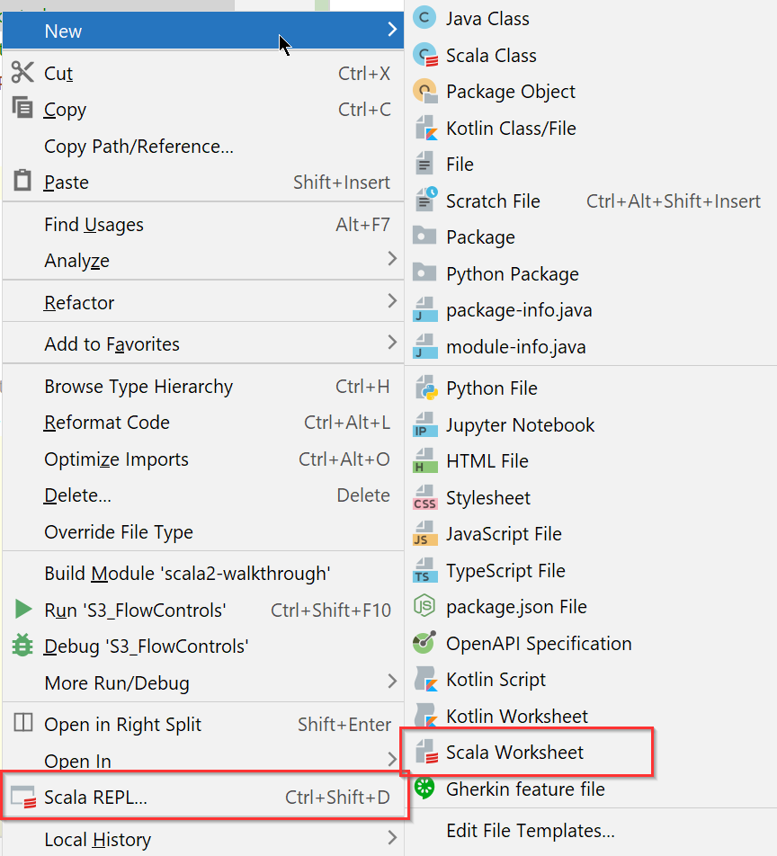
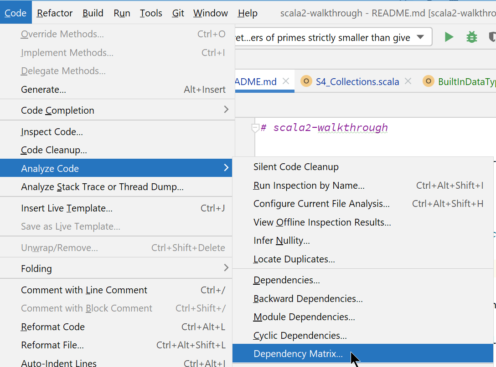
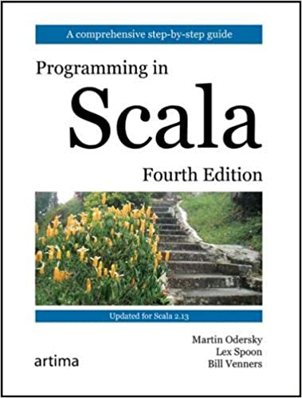
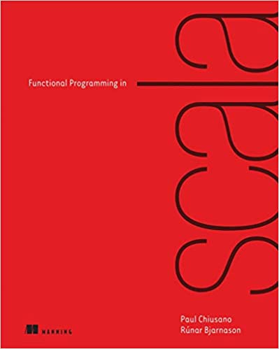
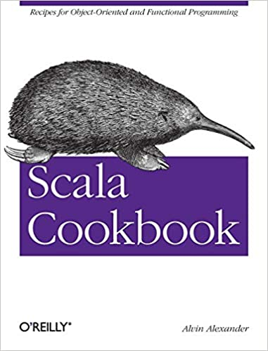

# scala2-walkthrough

Desired/First Impression: not KISS
- 80% of coding should be done in 20% APIs. With so many APIs, hard to know which one is faster.
- Fast coding like Python: short circuit frequently used APIs, like Python and C# syntax sugar.
  My LeetCode Python solutions are <= 20 lines mostly.
- With so many APIs, other tools such as IntelliJ is easy to be broken. Less used flexibility
  has virtually no value but confusion. We need an optimized version.

Wait until we get Spark.

[Scala docs](https://docs.scala-lang.org/api/all.html)

IntelliJ has Scala WorkSheet and Scala REPL

## Minimal Requirements

### sbt
[sbt Introduction](sbt.md)

### Unit Tests and Test Coverage
[Unit Tests and Test Coverage](test-coverage.md)

### Logging
https://github.com/lightbend/scala-logging

http://software.clapper.org/grizzled-slf4j/index.html is a wrapper around slf4j.

### Profilers

IntelliJ has several profilers, https://blog.jetbrains.com/idea/2020/03/profiling-tools-and-intellij-idea-ultimate/

sbt has https://github.com/sbt/sbt-jmh.

https://github.com/jvm-profiling-tools/async-profiler/issues/381

Flamegraph:
- https://github.com/brendangregg/FlameGraph
- https://queue.acm.org/detail.cfm?id=2927301
- https://hacked.work/blog/flame-graphs-and-scala/
- https://johnysswlab.com/flamegraphs-understand-where-your-program-is-spending-time/

Performance testing tools:
- [scalameter](https://github.com/scalameter/scalameter). A good example is
  https://dev.to/awwsmm/benchmarking-scala-with-scalameter-pt-2-scala-dcp-004-4n93
- [gatling](https://github.com/gatling/gatling)

### UML and Class Diagrams
There is no good tool currently. We need a tool to show all relations
- classes
- hierarchy
- associations and dependencies

IntelliJ does a good job for Java, but not scala. Other tools, such as
[sbt-class-diagram](https://github.com/xuwei-k/sbt-class-diagram)
and 
[scaladiagrams](https://github.com/mikeyhu/scaladiagrams),
do not show all relations.

### Dependency Matrix
Dependency matrix - to analyze module dependencies

Started from [JDepend](https://github.com/nidi3/jdepend), now is 
[code-assert](https://github.com/nidi3/code-assert). IntelliJ has same
functionality here:

Here is an internal 
[explanation](http://blog.rcard.in/programming/oop/software-engineering/2017/04/10/dependency-dot.html)
plus usage: 
https://dzone.com/articles/dependency-structure-matrix-for-software-architect

https://www.vojtechruzicka.com/idea-analyzing-dependencies/

https://www.jetbrains.com/help/idea/dependencies-analysis.html#analyze-dependencies

https://www.jetbrains.com/help/idea/dsm-analysis.html

## Built-in Data Types
[Code Examples](src/main/scala/org/mytest/scala/walkthrough/S1_BuiltInDataTypes.scala)
explains the details.

https://www.47deg.com/blog/adventures-with-scala-collections/

https://stackoverflow.com/questions/10866639/difference-between-a-seq-and-a-list-in-scala

Here is the entire Scala Type system(from https://docs.scala-lang.org/tour/unified-types.html)

## Strings
println(s"($i, $j)")

## Operators
From here: https://www.tutorialspoint.com/scala/scala_operators.htm

Arithmetic Operators: + - * / %

Bitwise Operators: & | ^ ~ << >> >>>

Boolean Operators: && || !

Relational Operators: == != > >= < <=

Assignment Operators: = += -= *= /= %= &= |= ^= <<= >>=

Precedence

Category 	Operator 	Associativity  
Postfix 	() [] 	Left to right  
Unary 	! ~ 	Right to left  
Multiplicative 	* / % 	Left to right  
Additive 	+ - 	Left to right  
Shift 	>> >>> << 	Left to right  
Relational 	> >= < <= 	Left to right  
Equality 	== != 	Left to right  
Bitwise AND 	& 	Left to right  
Bitwise XOR 	^ 	Left to right  
Bitwise OR 	| 	Left to right  
Logical AND 	&& 	Left to right  
Logical OR 	|| 	Left to right  
Assignment 	= += -= *= /= %= >>= <<= &= ^= |= 	Right to left  
Comma 	, 	Left to right  

## Flow Controls

[Types of Types](https://ktoso.github.io/scala-types-of-types/)

[An Introduction to Type Classes in Scala](https://medium.com/decisionbrain/an-introduction-to-type-classes-in-scala-790069926d07)

https://baihuqian.github.io/tags/#Scala

## Collections
https://www.jesperdj.com/2015/11/22/the-magic-of-for-yield-with-scala-collections/

## Dependency Graph

https://www.baeldung.com/scala/sbt-dependency-tree

## Profiling
https://www.jetbrains.com/help/idea/java-flight-recorder.html#jfr-configurations
https://blog.jetbrains.com/idea/2020/03/profiling-tools-and-intellij-idea-ultimate/
https://bell-sw.com/announcements/2020/07/22/Hunting-down-code-hotspots-with-JDK-Flight-Recorder/
https://www.brendangregg.com/flamegraphs.html
https://medium.com/@muuki88/follow-the-stacktraces-jvm-performance-profiling-3c371d323e5f
https://users.scala-lang.org/t/how-to-profile-my-code/4752/9
https://stackoverflow.com/questions/9160001/how-to-profile-methods-in-scala

https://dev.to/frosnerd/microbenchmarking-your-scala-code-4885
https://github.com/scalameter/scalameter

https://medium.com/virtuslab/revisiting-scala-native-performance-67029089f241
book: Modern Systems Programming with Scala Native

https://medium.com/swlh/performance-test-on-an-api-using-gatling-85319ee32faa
https://alexandreesl.com/2020/02/12/gatling-making-performance-tests-with-scala/

https://scalac.io/blog/performance-testing/

## References
https://www.baeldung.com/scala/category/scala-basics

Images and links are from Amazon.

PiS4E: [Programming in Scala](https://www.amazon.com/Programming-Scala-Martin-Odersky/dp/098153161X) 

FPiS1E: [Functional Programming in Scala](https://www.amazon.com/Functional-Programming-Scala-Paul-Chiusano/dp/1617290653)

SC1E: [Scala Cookbook](https://www.amazon.com/Scala-Cookbook-Object-Oriented-Functional-Programming/dp/1449339611)

