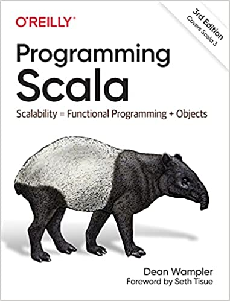

# scala2-walkthrough

Desired/First Impression: not KISS
- 80% of coding should be done in 20% APIs. With so many APIs, hard to know which one is faster.
- Fast coding like Python: short circuit frequently used APIs, like Python and C# syntax sugar.
  My LeetCode Python solutions are <= 20 lines mostly.
- With so many APIs, other tools such as IntelliJ is easy to be broken. Less used flexibility
  has virtually no value but confusion. We need an optimized version.
- Feel like it's in Python's 2010s, need more solid enterprise level tools and code efficiency.
  Spring is a good example. It's feature complete, fast coding, and well thought. Some tools can
  do something, but missing other features. Some fix some problems, but break downstream
  compositions. Some changes a lot on user API side over time and cause maintenance nightmares.
  Building solid and durable tools requires a lot of industrial hands-on experience.
- Some inheritance hierarchies are too deep, feel in the same 1990's Visual C++ hierarchy hell.
  When I attended my first C++ course in the old AT&T, the first rule for inheritance I was told
  is that never go beyond 3 levels, otherwise people could have a hard time to understand your
  code. I benefit from this advice in my entire career. Sometimes, we have the freedom, but do we
  want to get out of control?

Wait until we get Spark.

Scala is a great and unique language because of its powerful type system. Spark and Kafka are
examples of what it can do. DSL is another advantage.

Scala3 syntax behaves closer to Python than Scala2([PS3E](#PS3E)). It's a great improvement.

[Scala docs](https://docs.scala-lang.org/api/all.html)

IntelliJ has Scala WorkSheet and Scala REPL

## Minimal Requirements

#### sbt
[sbt Introduction](docs/sbt.md)

#### Unit Tests and Test Coverage
[Unit Tests and Test Coverage](docs/test-coverage.md)

#### Logging
https://github.com/lightbend/scala-logging is a wrapper around slf4j

http://software.clapper.org/grizzled-slf4j/index.html is another wrapper around slf4j.

## Profilers

IntelliJ has several profilers, https://blog.jetbrains.com/idea/2020/03/profiling-tools-and-intellij-idea-ultimate/

sbt has https://github.com/sbt/sbt-jmh.

https://github.com/jvm-profiling-tools/async-profiler/issues/381

Flamegraph:
- https://github.com/brendangregg/FlameGraph
- https://queue.acm.org/detail.cfm?id=2927301
- https://hacked.work/blog/flame-graphs-and-scala/
- https://johnysswlab.com/flamegraphs-understand-where-your-program-is-spending-time/

Performance testing tools:
- [scalameter](https://github.com/scalameter/scalameter). A good example is
  https://dev.to/awwsmm/benchmarking-scala-with-scalameter-pt-2-scala-dcp-004-4n93
- [gatling](https://github.com/gatling/gatling)

https://www.jetbrains.com/help/idea/java-flight-recorder.html#jfr-configurations

https://bell-sw.com/announcements/2020/07/22/Hunting-down-code-hotspots-with-JDK-Flight-Recorder/

https://www.brendangregg.com/flamegraphs.html

https://medium.com/@muuki88/follow-the-stacktraces-jvm-performance-profiling-3c371d323e5f

https://users.scala-lang.org/t/how-to-profile-my-code/4752/9

https://stackoverflow.com/questions/9160001/how-to-profile-methods-in-scala

https://dev.to/frosnerd/microbenchmarking-your-scala-code-4885

https://medium.com/virtuslab/revisiting-scala-native-performance-67029089f241
book: Modern Systems Programming with Scala Native

https://medium.com/swlh/performance-test-on-an-api-using-gatling-85319ee32faa
https://alexandreesl.com/2020/02/12/gatling-making-performance-tests-with-scala/

https://scalac.io/blog/performance-testing/

https://medium.com/mop-developers/parallel-computing-in-python-and-scala-37d3561b4c08

## UML and Class Diagrams
There is no good tool currently. We need a tool to show all relations
- classes
- hierarchy
- associations and dependencies

IntelliJ does a good job for Java, but not scala. Other tools, such as
[sbt-class-diagram](https://github.com/xuwei-k/sbt-class-diagram)
and 
[scaladiagrams](https://github.com/mikeyhu/scaladiagrams),
do not show all relations.

## Dependency Matrix
Dependency matrix - to analyze module dependencies

Started from [JDepend](https://github.com/nidi3/jdepend), now is 
[code-assert](https://github.com/nidi3/code-assert). IntelliJ has same
functionality here:

Here is an internal 
[explanation](http://blog.rcard.in/programming/oop/software-engineering/2017/04/10/dependency-dot.html)
plus usage: 
https://dzone.com/articles/dependency-structure-matrix-for-software-architect

https://www.vojtechruzicka.com/idea-analyzing-dependencies/

https://www.jetbrains.com/help/idea/dependencies-analysis.html#analyze-dependencies

https://www.jetbrains.com/help/idea/dsm-analysis.html

## References

Images and links are from Amazon.

<a name="PS3E">PS3E</a>: [Programming Scala](https://www.amazon.com/Programming-Scala-Scalability-Functional-Objects/dp/1492077895)

SFTI2E: [Scala for the Impatient](https://www.amazon.com/Scala-Impatient-2nd-Cay-Horstmann/dp/0134540565)
https://horstmann.com/scala/

SC1E: [Scala Cookbook](https://www.amazon.com/Scala-Cookbook-Object-Oriented-Functional-Programming/dp/1449339611)

PiS4E: [Programming in Scala](https://www.amazon.com/Programming-Scala-Martin-Odersky/dp/098153161X) 

FPiS1E: [Functional Programming in Scala](https://www.amazon.com/Functional-Programming-Scala-Paul-Chiusano/dp/1617290653)

https://baihuqian.github.io/tags/#Scala

https://www.baeldung.com/scala/category/scala-basics

https://www.handsonscala.com/table-of-contents.html

http://twitter.github.io/scala_school/

http://twitter.github.io/effectivescala/

https://github.com/lauris/awesome-scala

https://typelevel.org/cats/

symbolic operators: https://stackoverflow.com/questions/7888944/what-do-all-of-scalas-symbolic-operators-mean

scala copy vs clone - copy while changing values

https://stackoverflow.com/questions/8715562/how-to-make-this-first-not-null-result-function-more-elegant-concise/8716102

https://books.underscore.io/shapeless-guide/shapeless-guide.html
https://github.com/milessabin/shapeless

https://www.baeldung.com/scala/lazy-val

You need to convert the map to a Seq and mark it as a varargs element like this:

 myFunction(p.toSeq: _*)

https://dev.to/z2yjxfnrkb/foldleft-map-and-filter-in-scala-3l6e

https://stackoverflow.com/questions/26501865/scala-why-foldleft-cant-work-for-an-concat-of-two-list

https://www.researchgate.net/publication/336449888_Scala_implicits_are_everywhere_a_large-scale_study_of_the_use_of_Scala_implicits_in_the_wild
