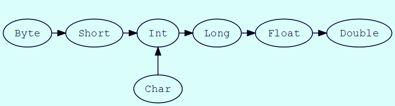

# Scala Built-in Data Types

## Data Type Hierarchy

Here are the built-in types and the hierarchy, from
https://docs.scala-lang.org/tour/unified-types.html

## Strings
println(s"($i, $j)")

## Operators
From here: https://www.tutorialspoint.com/scala/scala_operators.htm

Arithmetic Operators: + - * / %

Bitwise Operators: & | ^ ~ << >> >>>

Boolean Operators: && || !

Relational Operators: == != > >= < <=

Assignment Operators: = += -= *= /= %= &= |= ^= <<= >>=

Precedence

Category 	Operator 	Associativity  
Postfix 	() [] 	Left to right  
Unary 	! ~ 	Right to left  
Multiplicative 	* / % 	Left to right  
Additive 	+ - 	Left to right  
Shift 	>> >>> << 	Left to right  
Relational 	> >= < <= 	Left to right  
Equality 	== != 	Left to right  
Bitwise AND 	& 	Left to right  
Bitwise XOR 	^ 	Left to right  
Bitwise OR 	| 	Left to right  
Logical AND 	&& 	Left to right  
Logical OR 	|| 	Left to right  
Assignment 	= += -= *= /= %= >>= <<= &= ^= |= 	Right to left  
Comma 	, 	Left to right  

## Type Casting

## Collection Types

They are discussed elsewhere.
