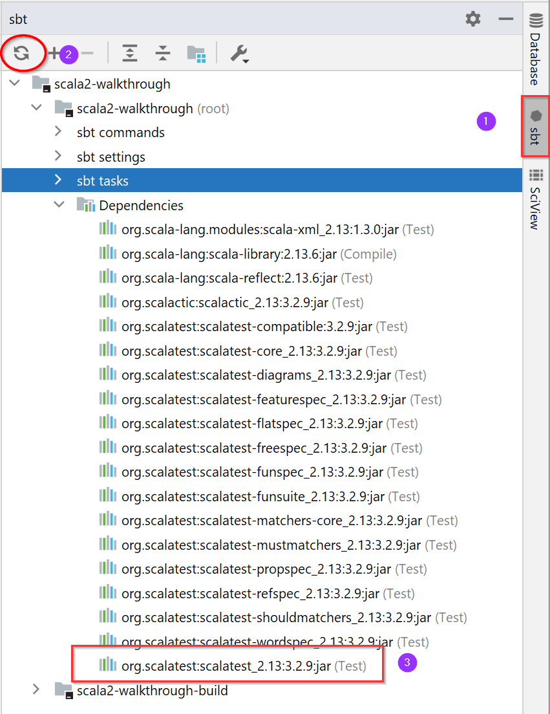

# Unit Tests and Test Coverage

## Unit Tests
One of the Scala testing libs is [scalaTest](https://www.scalatest.org/) hosted on
the [GitHub](https://github.com/scalatest/scalatest).

Add this line to the build.sbt under root
```
libraryDependencies += "org.scalatest" %% "scalatest" % "3.2.9" % "test"
```
This specifies package, lib(along with scala version), version, and scope.

Then refresh the project



A sample unit test is 
[NumbersUtilTest](src/test/scala/org/mytest/scala/walkthrough/s1_DataTypes/NumbersUtilTest.scala)
for the class
[NumberUtil](src/main/scala/org/mytest/scala/walkthrough/s1_DataTypes/NumbersUtil.scala).

First, make sure it runs in IDE. Then we can run from command line:
```
sbt clean test
```
To run only certain tests
```
sbt "testOnly *UtilsTest"
```
Another way to filter tests is: https://www.scalatest.org/user_guide/tagging_your_tests.

To run from command line(not in common use), use 
[org.scalatest.run](https://www.scalatest.org/scaladoc/1.8/org/scalatest/run$.html):
```
scala -cp scalatest-RELEASE.jar org.scalatest.run ExampleSpec
```
(We can set up an Application in IntelliJ as well).

## Mocking
Check https://www.scalatest.org/plus/mockito

## Test Coverage
IntelliJ has the test coverage built-in. sbt has a plugin 
[sbt-scoverage](https://github.com/scoverage/sbt-scoverage) based on
[scoverage](http://scoverage.org/). Search https://search.maven.org/ for latest versions.

Add the following line to the project/plugins.sbt

```
addSbtPlugin("org.scoverage" % "sbt-scoverage" % "1.9.0")
```

Now run
```
sbt clean coverage test coverageAggregate
```
if there are more than one module, or the following if there is only 1 module
```
sbt clean coverage test coverageReport
```
The task coverage has be before test and report has to be after test, or there is
no report generated. Without report, the coverage data in XML is generated in
each module's folder. The task report or aggregate will generate readable html
under the root/target/scala-<version>/scoverage-report

## Other Tools

Not sure how useful they are, given IntelliJ. I haven't seen one project free of
IntelliJ warnings(except mine). So ignore these for now:
- [Scalastyle](http://www.scalastyle.org/)
- [Scalafmt](https://scalameta.org/scalafmt/)

It's a common practice to integrate test coverage with Jenkins & SonarQube so
that we have an overview of coverage + drill down if needed.
